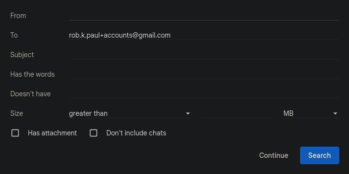
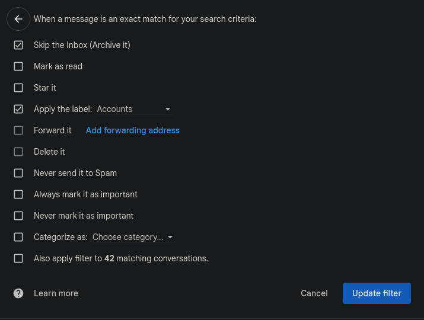
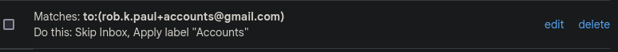
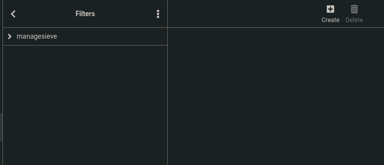
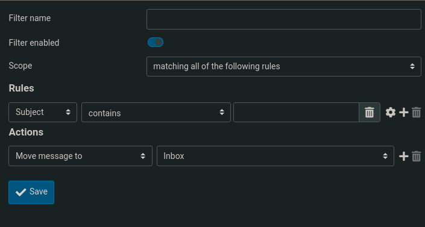

# Death by 1000 Email Filters

by Robert Paul, 10/11/2023

Once you reach a terminal mass of accounts on various websites, it becomes pretty essential that you start filtering your emails. Recently, I have found myself careening into such a state, where the amount of emails I get on a given day between personal, account updates, and online order updates reaches well above 15 emails every day. 

The first solution was Google's aliasing function, where you can add a '+' to the email address, then an extra word. You can then search for emails sent to that email, then create a filter from the search. 

After doing that, you're ready to go! As far as "poweruser" features go, this one is impressively easy to go throug h with. The only issue I ended up having was I couldn't find a "run" button to have it apply to all my existing emails meeting the rule. In the filter settings page, it's shown as one of the rules you can use, which is an interesting choice, but could be improved if there was a "run" button on the page showing all of your filters instead.

But, what if that is not enough? My password manager says I have 367 logins as of today. There is no way I have time to go through each of those and make sure they're using the new format of \<email\>+accounts@gmail.com. A good portion of my most used website don't even accept the '+' symbol for email. The emails still roll in endlessly every day! It's time for the nuclear option: creating an entire new email, but doing things differently this time. Since not all websites recognize the '+', that's not an option. I own robertpaul.dev, so let's set up email on it!

I chose to set up an email with [MXRoute](mxroute.com) under the recommendations of some friends. It has worked great, and is really nice to be able to spin up new emails immediately. Filters, however, are not as easy to create as they are on Gmail. The only way to edit filters on MXRoute currently is to go to their provided Web Portal and set them up there, for each account you have. And the UI is no where near as robust.

When you go to create a filter on MXRoute, you are greeted by this, which is definitely not as sleek as the GMail settings, but that can be redeemed

Once you actually begin creating a filter, it becomes clear that you have just the same tools at your disposal that Gmail gives you... and the additional benefit of Sieve access, which you can see in the page before. Sieve is a programming language specifically built for Email filtering, first released in 1999. While it has limited capabilities the choice to give access to both of these interfaces for filtering provides some great ltools for users trying to maximize their productivity.

In my journey through the jungle of these two different implementations of Email Filtering, I think what really shines through is that different things work for different users. Providing an entry point for users searching their emails to filter them is a great idea, but can be a little backwards to someone used to just punching a full filter together in something like Outlook. On the other hand, MXRoute's solution provides the more expected solution and the additional ability for real power users to go in and edit their filters through Sieve.