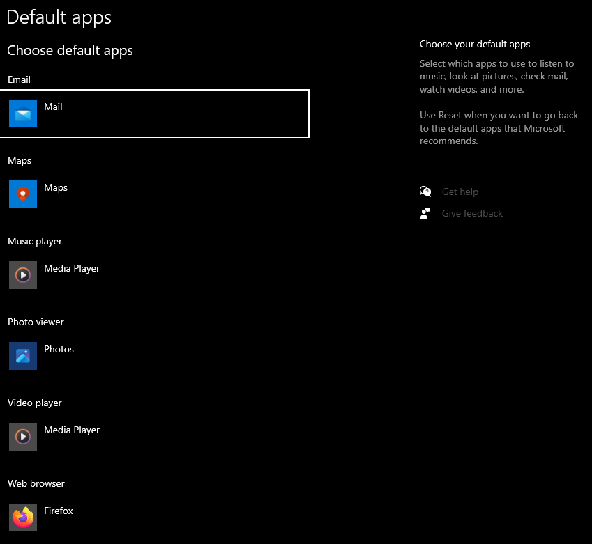
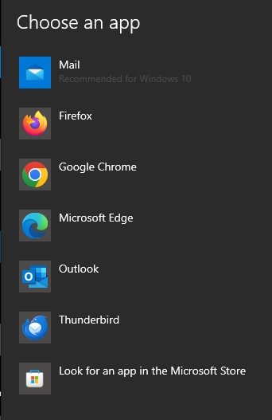
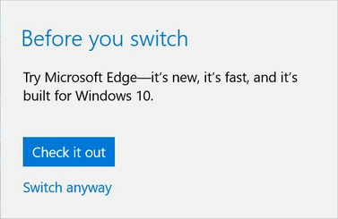
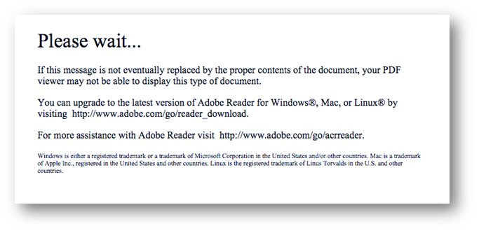
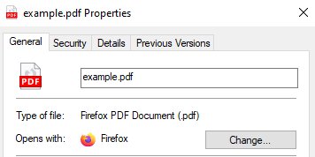

# Default Apps

During the semester, I work at Chico State's ITSS, solving user issues through remote support daily. Without fail, at least once a week, trying to change the default apps on their computer will thwart a user, and land them in a remote support session with me. Let's take a look at why.

There are 3 main reasons to visit this page: changing the email application, changing the browser, and changing the pdf reader. 

## Email

Changing your email application is the most straightforward of the options, presenting you with the current option, then allowing you to change it by clicking, and presenting you with the installed options. We do get the first inkling of an issue with **efficiency** here, if your app is not listed you can only choose another option from the Microsoft app store, not any other installed app.

## Web Browser

By default the browser in Windows 10 is set to Microsoft's own browser, Microsoft Edge. In order to switch it away, you must go to the default apps page, and click the app you want, with an additional wrinkle, once you have selected a new app, you get the following pop-up.

While this pop-up seems innocuous, it uses a **call-to-action** button to direct users to keep Microsoft Edge as their browser, even though they have already clicked another browser. One more issue exists with their implementation. Windows 10 has a search function that can be accessed in the toolbar. Typically, this is used to search for apps or files on the PC, but can also be used to search the internet. A user's **cognitive model** may dictate that searching the internet using this dialogue would open in their default browser, however it will always open with Edge, unless the default browser is set to the 3rd party Open Source solution of [edge deflector](https://github.com/da2x/EdgeDeflector), which was recently sabotaged by Microsoft, killing opportunity for user  choice.

## PDF Reader

This is, so to speak: the final boss of changing default applications. PDFs are the standardized format for shared, uneditable documents. Defined in ISO-32000, the PDF standard document itself is 757 pages of defining how to read and write pdfs. On top of this, Adobe has their own ".pdf" definition for form-fillable pdfs. By default, these pdfs will open with the defined pdf default app, and will greet the user with the following error:

This error is extremely unhelpful, and is often confusing to users who believe they are opening the PDF in acrobat. This is a great example of poor **error-tolerance**. Instead, an error stating more clearly that this document can only be read in Adobe Acrobat, rather than directly hinting at it would be more helpful to users. Instead, this one seems to imply to users they may already be using Adobe Acrobat, which often leads users to being confused.

So let's say the user has figured out that they need to change how they're opening pdfs. There's two ways to go about this. First, they may try checking the properties of the document.

This leads them in the right direction, and then leads them to the same page that shows up for other default app switches. The less wise may go to default apps, and then click on the "choose default apps by file type". This leads to a monstrous list of every file type that windows 10 recognizes. Every single one. This breaks several core tenets of usability: **efficiency and satisfaction** being core. This could very easily be solved with the **convention** typically used in the navigation of long lists, a search bar.